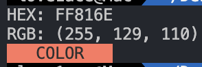

# hex-to-rgb-cli

**hex-to-rgb-cli** is a CLI tool that converts hex to rgb.


## Quick Start

Get **hex-to-rgb-cli** up and running quickly!

1. **Run**:
    ```bash
    npx hex-to-rgb-cli #FF0000
    ```
    or
    ```bash
    npx hex-to-rgb-cli FF0000
    ```
2. **Done!**

### Example Output

This will convert the hex color `#FF0000` (or `FF0000`) to its RGB equivalent, and display a color preview in your terminal.

- **Input**: `#FF816E` or `FF816E`
- **Output**: `RGB: (255, 129, 110)`
- **Color Preview**: `RED COLOR PREVIEW`



## Contributing

We welcome contributions to **hex-to-rgb-cli**! Whether it's reporting a bug, suggesting an enhancement, or submitting a pull request, your input is valued.

## License

This project is licensed under the MIT License - see the [LICENSE](LICENSE) file for details.

## Contact

For any questions, suggestions, or feedback, please contact [love1ace](mailto:lovelacedud@gmail.com).